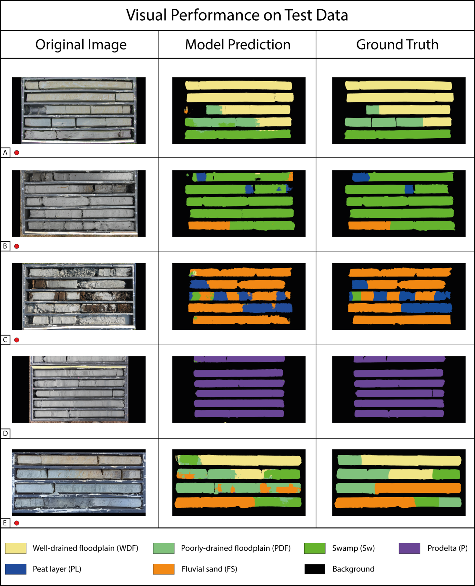

# CoreNet

Official implementation of the paper "PAPER" (DOI: PAPER_DOI).



## Requirements

- Python (3.9), Tensorflow (2.9.0), numpy (1.22.3), scikit-learn (1.0.1), pandas (1.4.2), opencv-python (4.6.*), matplotlib (3.5.0)

## Usage

### Predict full resolution images with a trained model

The script [predict_images.py](predict_images.py) can be used to predict the segmentation masks of a given set of images. It can also produce the confidence and error maps as described in the paper. In order to produce the error maps, maskdir must be specified. It can be used as follows:

```bash
python predict_images.py --imdir IMAGE_PATH --maskdir MASK_PATH --weights WEIGHTS_PATH --saveimdir SAVE_IMAGE_PATH
```

It accepts the following arguments:

- `--imdir`: Path to the directory containing the images. Default: ./Images
- `--maskdir`: Path to the directory containing the masks. Default: ./Masks
- `--weights`: Path to the weights of the trained model. Default: ./best_model.h5
- `--saveimdir`: Path to the directory where the predicted masks will be saved. Default: ./Predictions
- `--patch_size`: Size of the patches to be extracted. Default: 384
- `--stride`: Stride of the sliding window for patch saving. If < patch_size, overlapping patches will be produced. Default: 384
- `--target_h`: Target height of the images. Default: 1538
- `--target_w`: Target width of the images. Default: 3074
- `--error`: If specified, error maps will be produced. Default: True
- `--confidence`: If specified, confidence maps will be produced. Default: True
- `--resized_images`: Whether to save a copy of the resized images. Default: True
- `--batch_size`: Batch size for prediction. Default: 8

### Evaluate a trained model

The script [model_evaluation.py](model_evaluation.py) can be used to evaluate a trained model. It can be used as follows:

```bash
python model_evaluation.py --imdir IMAGE_PATH --maskdir MASK_PATH --savedir SAVE_PATH --weights WEIGHTS_PATH
```

It accepts the following arguments:

- `--imdir`: Path to the directory containing the image patches. Default: ./Images
- `--maskdir`: Path to the directory containing the mask patches. Default: ./Masks
- `--savedir`: Path to the directory where the evaluation results will be saved. Default: ./Results
- `--weights`: Path to the weights of the trained model. Default: ./best_model.h5
- `--patch_size`: Size of the patches to be extracted. Default: 384
- `--save_cm` : If specified, the confusion matrix will be saved. Default: True
- `--batch_size`: Batch size for prediction. Default: 8

### Generate patches

The script [save_patches.py](save_patches.py) can be used to extract patches from a given image. It is useful only if you want to train a new model from scratch. The script can be used as follows:

```bash
python save_patches.py --imdir IMAGE_PATH --maskdir MASK_PATH --saveimdir SAVE_IMAGE_PATH --savemaskdir SAVE_MASK_PATH
```

It accepts the following arguments:

- `--imdir`: Path to the directory containing the images. Default: ./Images
- `--maskdir`: Path to the directory containing the masks. Default: ./Masks
- `--saveimdir`: Path to the directory where the extracted patches will be saved. Default: ./Images_patches
- `--savemaskdir`: Path to the directory where the extracted masks will be saved. Default: ./Masks_patches
- `--patch_size`: Size of the patches to be extracted. Default: 384
- `--stride`: Stride of the sliding window for patch saving. If < patch_size, overlapping patches will be produced. Default: 384
- `--trhesh`: Threshold to exclude patches that are mostly background. Default: 0.1
- `--target_h`: Target height of the images. Default: 1538
- `--target_w`: Target width of the images. Default: 3074

### Train your own model

[main.py](main.py) can be used to train a segmentation model from scratch, or fine-tune a pre-trained model. The script reflects the training procedure described in the paper; if you wish to use your own training strategy you will need to either modify the script or write a new one. The code relies on another repo I was developing called [segmentation_models](https://github.com/GianlucaCarlini/segmentation_models), which contains implementations for various segmentation models written in Tensorflow. You can for example instantiate a U-Net with different backbones as follows:

```python
from segmentation_models.models import Unet
#resnet50
model = Unet(
    input_shape=(384, 384, 3), backbone="resnet50", classes=1, final_activation="sigmoid"
)
#efficientnetb0
model = Unet(
    input_shape=(384, 384, 3), backbone="efficientnetb0", classes=1, final_activation="sigmoid"
)
```

However, since I'm currently switching to Pytorch, it is possible that the repo will not be updated anymore. In any case, it is just an utility repo and you can easily write your own model or use any other segmentation model implementation.

The script can be used as follows:

```bash
python main.py --trainimdir TRAIN_IMAGE_PATH --trainmaskdir TRAIN_MASK_PATH --valimdir VAL_IMAGE_PATH --valmaskdir VAL_MASK_PATH --weights WEIGHTS_PATH
```

Provide the weights parameter if you want to fine-tune a pre-trained model, otherwise the model will be trained from scratch.

It accepts the following arguments:

- `--trainimdir`: Path to the directory containing the training images. Default: ./train_image_patches
- `--trainmaskdir`: Path to the directory containing the training masks. Default: ./train_masks_patches
- `--valimdir`: Path to the directory containing the validation images. Default: ./val_images_patches
- `--valmaskdir`: Path to the directory containing the validation masks. Default: ./val_masks_patches
- `--backbone`: Backbone to be used for the model. Default: efficientnetb3
- `--weights`: Path to the weights of the pre-trained model. Default: None
- `--batch_size`: Batch size for training. Default: 8
- `--epochs`: Number of epochs. Default: 100
- `--lr`: Learning rate. Default: 1e-4
- `--final_lr`: Final learning rate. Default: 5e-6
- `--patch_size`: Size of the patches. Default: 384
- `--ckpt_path`: Path to save the model checkpoints. Default: ./ckpt
- `--history_path`: Path to save the training history. Default: ./history
